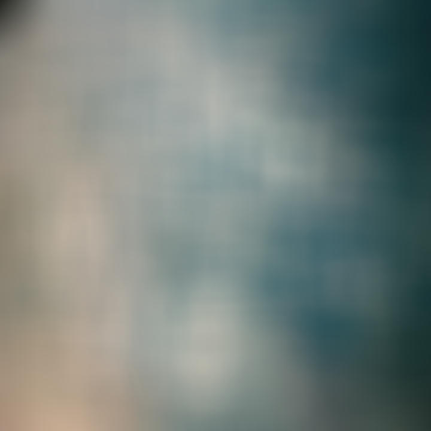

# image-filter ✨
     

A playground in which I experiment and learn about image filters.

## Usage

### Flags
 Flag             | Details           | Default 
------------------|-------------------|------------
`-i` / `--input`  | Image input       | input.jpg
`-o` / `--output` | Image output      | output.jpg
`-x`              | Crop x-coordinate | 0
`-y`              | Crop y-coordinate | 0
`-w` / `--width`  | Crop width        | Image width
`-h` / `--height` | Crop height       | Image width
`-v`              | Verbose output    | false

An explanation for each setting can also be found via:
```shell
$ image-filter --help
```


#### Cropping

Optionally, an image filter can be partially applied in the following way:

```shell
$ image-filter -i input.jpg -x 160 -y 160 -w 400 -h 400 gaussian1d -s 50.0
```

### Subcommands

### Box blur

 Flag             | Details                | Default
------------------|------------------------|-----------
`-r` / `--radius` | Blur strength (radius) | 1



```shell
$ image-filter -i a.jpg -o b.jpg box_blur_1d -r 10
```
```shell
$ image-filter -i a.jpg -o b.jpg box_blur_2d -r 10
```

### Gaussian blur

 Flag            | Details               | Default
-----------------|-----------------------|-----------
`-s` / `--sigma` | Blur strength (sigma) | 0.84089642


```shell
$ image-filter -i a.jpg -o b.jpg gaussian_blur_1d -s 10.0
```
```shell
$ image-filter -i a.jpg -o b.jpg gaussian_blur_2d -s 10.0
```

### Sobel

 Flag            | Details               | Default
-----------------|-----------------------|-----------
`-s` / `--sigma` | Blur strength (sigma) | None


```shell
$ image-filter -i a.jpg -o b.jpg sobel_2d -s 1.0
```

## Benchmarking
Criterion is used to benchmark performance. See the [user
guide](https://bheisler.github.io/criterion.rs/book/index.html) and
documentation for information on how to generate reports.

To run a specific benchmark, i.e. `gaussian_250x250`, the following command can be used:

```shell
$ cargo bench -- gaussian_250x250
```

To save a given baseline to compare against: 

```shell
$ cargo bench --bench gaussian -- --save-baseline example_a --sample-size 25
```

To compare against a saved baseline: 

```shell
$ cargo bench --bench gaussian -- --load-baseline example_b --baseline example_a
```

## License

* This project is released under the [MIT License](https://github.com/imjasonmiller/image-filter/blob/master/LICENSE.md)

* Image, ["Chaotic Clouds of Jupiter"](https://www.jpl.nasa.gov/spaceimages/details.php?id=PIA22424), via NASA/JPL-Caltech/SwRI/MSSS/Gerald Eichstad/Sean Doran is [CC-NC-SA](https://creativecommons.org/licenses/nc-sa/1.0/)
